# Cast of Many Characters

A Django web application for creating, managing, and tracking Dungeons & Dragons character sheets. Built with modern web technologies, this app provides an intuitive interface for D&D players to manage their characters with full CRUD functionality, user authentication, and responsive design.

-  Deployed Site: https://dnd-character-03ac7e2db9d3.herokuapp.com/

---

## 📋 Table of Contents

-   [🚀 Features](#-features)
-   [🛠️ Technology Stack](#️-technology-stack)
-   [🗂️ Database Design](#️-database-design)
-   [📸 Application Screenshots](#-application-screenshots)
-   [🚢 Deployment & Setup](#-deployment--setup)
-   [📝 Usage Guide](#-usage-guide)
-   [🧪 Testing & Quality Assurance](#-testing--quality-assurance)
-   [✅ Form Validation & User Experience](#-form-validation--user-experience)
-   [🎨 Design & User Interface](#-design--user-interface)
-   [🚢 Deployment](#-deployment)
-   [🤖 AI Development Assistance](#-ai-development-assistance)
-   [🏆 Credits & Acknowledgments](#-credits--acknowledgments)
-   [📄 License & Legal](#-license--legal)
-   [🔮 Future Enhancements](#-future-enhancements)
-   [🔗 Links & Resources](#-links--resources)

---

## 🚀 Features

-   **User Authentication:** Secure registration, login, and logout system
-   **Character Management:** Full CRUD operations for D&D characters
-   **Character Attributes:**
    -   Name, description, level (1-20) - Six ability scores: Strength, Dexterity, Constitution, Intelligence, Wisdom, Charisma
    -   Race, background, alignment selection - Multi-class support with class selection - Spell inventory management - Item inventory tracking - Feat assignment and tracking
-   **Quick Add Functionality:** Add custom spells and items directly from character edit page
-   **Responsive Design:** Mobile-first design with Bootstrap 5.3.0
-   **Form Validation:** Client and server-side validation with user-friendly error messages
-   **Admin Panel:** Django admin interface for comprehensive data management

---

## 🛠️ Technology Stack

-   **Backend:** Django 4.2.23, Python 3.13+
-   **Database:** PostgreSQL (production) / SQLite (development)
-   **Frontend:** Bootstrap 5.3.0, HTML5, CSS3, JavaScript
-   **Authentication:** Django's built-in authentication system
-   **Fonts:** Google Fonts (Cinzel, Roboto Slab)
-   **Deployment:** Heroku with Gunicorn and WhiteNoise
-   **Static Files:** WhiteNoise for static file serving

---

## 🗂️ Database Design

**Entity Relationship Model:**

The database follows Django best practices with normalized relationships:

-   **User:** Django's built-in User model for authentication
-   **Character:** Central entity containing character information and ability scores
-   **Race:** D&D races with traits and abilities
-   **Background:** Character backgrounds with associated skills
-   **Alignment:** Moral and ethical alignment options
-   **CharacterClass:** D&D classes (Fighter, Wizard, Rogue, etc.)
-   **Spell:** Magic spells with school and level information
-   **Item:** Equipment and inventory items
-   **Feat:** Special abilities with prerequisites

**Key Relationships:**

-   One-to-Many: User → Characters
-   Many-to-Many: Character ↔ Classes, Spells, Items, Feats
-   Foreign Keys: Character → Race, Background, Alignment

**ERD Lucid Chart**

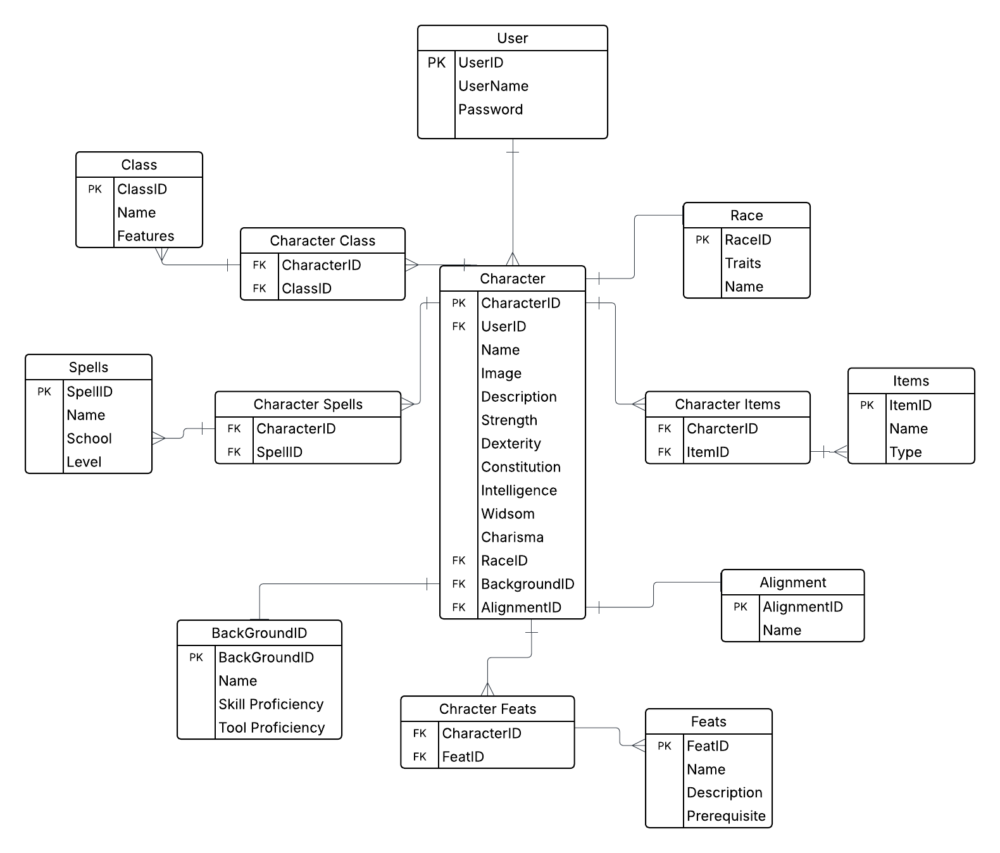

---

## 📸 Application Screenshots

### Home Page

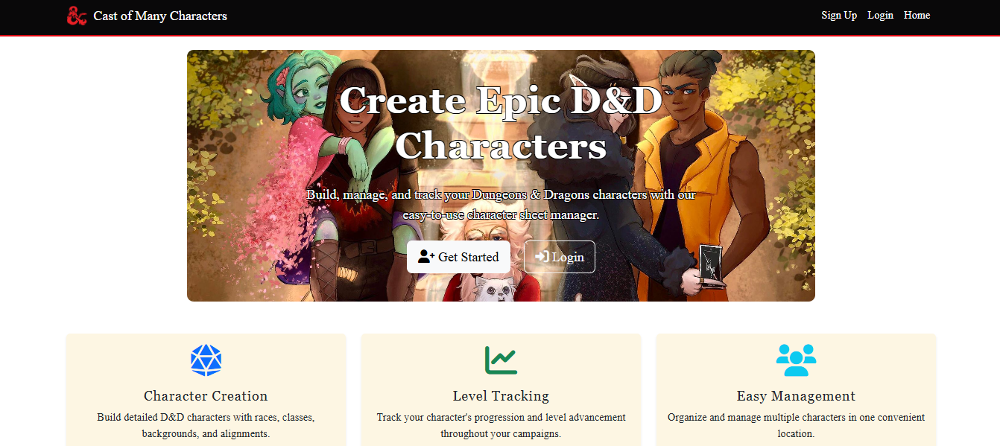

The homepage provides a welcoming introduction to the application, featuring a visually engaging hero image and a concise summary of the app’s purpose. Users can quickly access navigation links to register, log in, or explore the main features. The layout is responsive, ensuring a seamless experience across devices, and highlights the core benefits of managing D&D character sheets online.

### Character List

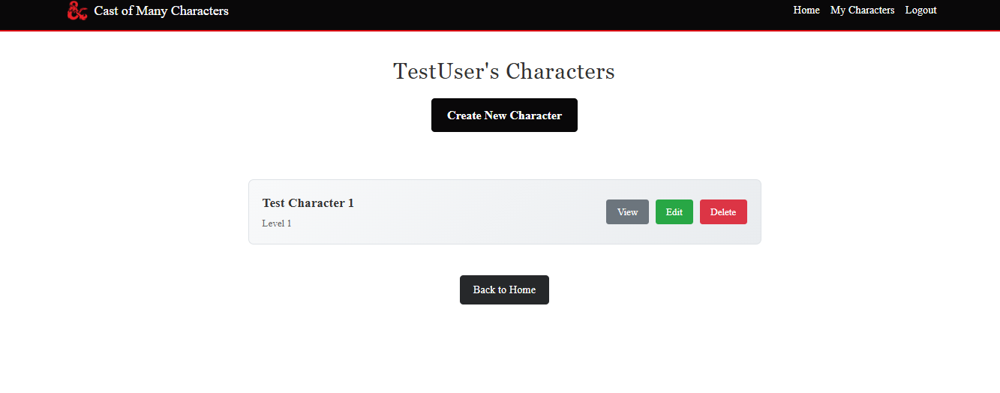

The Character List page displays all of your created D&D characters in a clean, organized table or card layout. Each entry shows key details such as character name, class, level, and race, with quick access buttons to view, edit, or delete each character. The page supports responsive design for easy browsing on any device, and provides a prominent button to create a new character.

### Character Creation Form

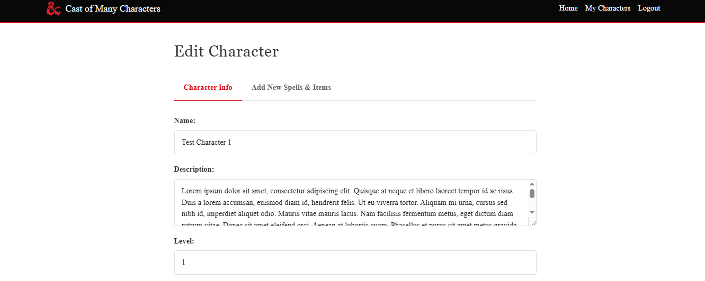
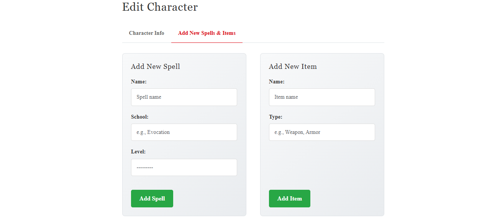
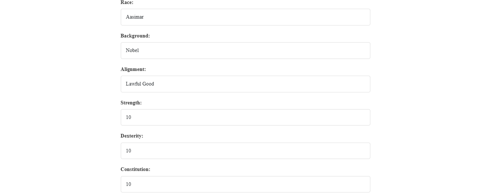
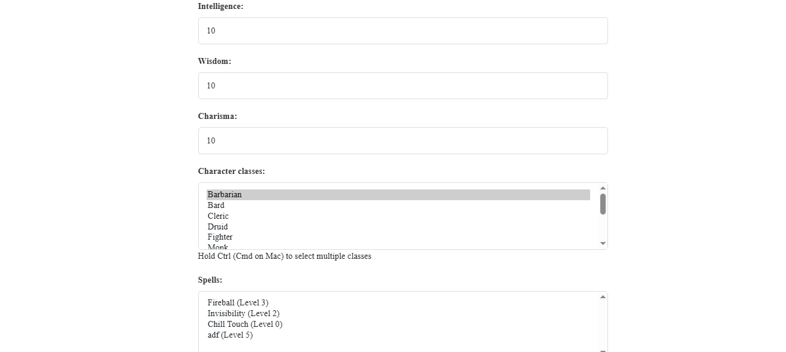
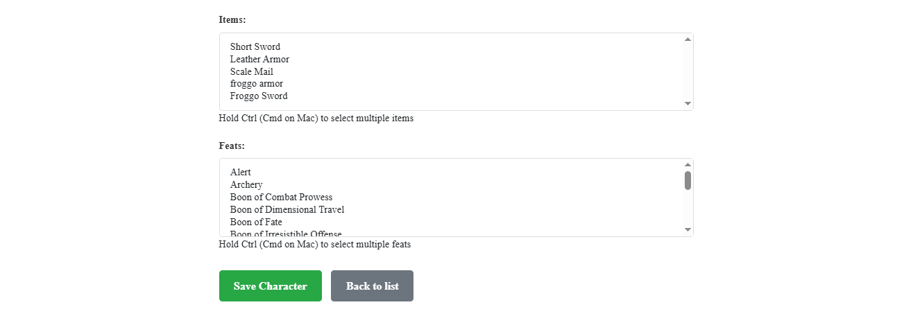

The Character Creation Form is a multi-step interface designed to guide users through building a new D&D character. Each section collects essential details, including name, level, ability scores, race, background, alignment, and class selections. The form supports multi-classing, custom spell and item additions, and real-time validation to ensure all entries meet D&D rules. Intuitive navigation and clear field descriptions make the process accessible for both new and experienced players.

### Character Detail View

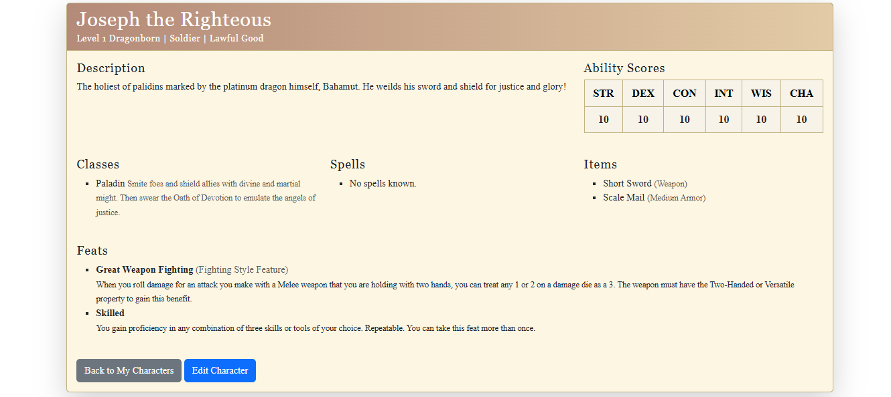

The Character Detail page presents a comprehensive view of an individual D&D character. It displays all key attributes, including name, level, race, background, alignment, ability scores, classes (with multi-class support), spells, items, and feats. The layout is organized for clarity, allowing users to easily review and manage their character’s information. Action buttons enable quick editing or deletion, and the design adapts seamlessly to both desktop and mobile devices for optimal usability.

### Mobile Responsive Design

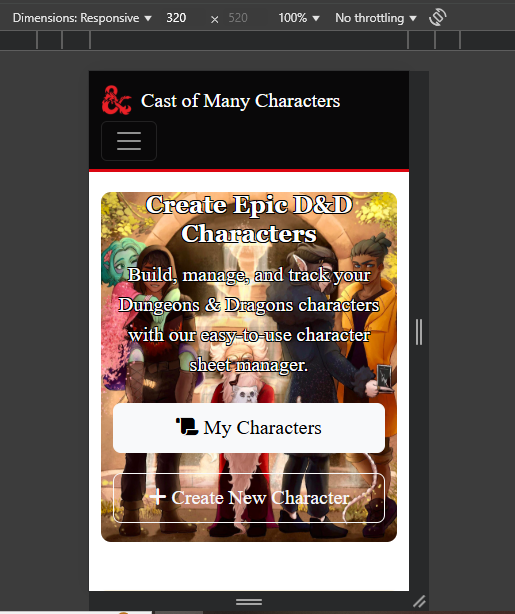

The website is fully responsive, ensuring an optimal user experience across all devices. The layout automatically adapts to different screen sizes, from smartphones and tablets to desktops. Navigation menus collapse into a mobile-friendly format, forms and tables resize for readability, and images scale appropriately. All interactive elements remain accessible and easy to use on touch devices, providing a seamless experience whether you're managing characters at your desk or on the go.

---

## 🚢 Deployment & Setup

### Heroku Deployment

The application is deployed on Heroku.

**What is Heroku?**  
Heroku is a cloud platform that enables developers to build, deploy, monitor, and manage applications with ease.

#### Prerequisites

-   A [Heroku](https://heroku.com) account (sign up if you don’t have one)
-   [Git](https://git-scm.com/) installed locally
-   [Python 3.13+](https://www.python.org/downloads/) installed

#### Deployment Steps

1. **Log in to Heroku**  
    Sign in to your Heroku account.

2. **Create a New App**

    - Click **New** > **Create new app**
    - Choose a unique app name and region, then click **Create app**

3. **Configure Environment Variables**

    - Go to the **Settings** tab and click **Reveal Config Vars**
    - Add the following keys:
        - `DISABLE_COLLECTSTATIC` = `1`
        - `DATABASE_URL` = _(your database URL, provided by your database service)_
        - `SECRET_KEY` = _(a secure, random string; use a [secret key generator](https://djecrety.ir/) if needed)_

4. **Prepare Your Project**  
    In your terminal, install dependencies and update requirements:

    ```bash
    pip install gunicorn~=20.1
    pip install -r requirements.txt
    pip freeze > requirements.txt
    ```

5. **Create Environment File**  
    At your project root, create an `env.py` file:

    ```python
    import os
    os.environ["DATABASE_URL"] = "your_database_url"
    os.environ["SECRET_KEY"] = "your_secret_key"
    ```

6. **Create a Procfile**  
    At the project root, add a file named `Procfile` with:

    ```
    web: gunicorn my_project.wsgi
    ```

7. **Update Django Settings**

    - Set `DEBUG = False` in `settings.py` (**important for security**)
    - Add `'.herokuapp.com'` to the `ALLOWED_HOSTS` list

8. **Push to GitHub**  
    Commit and push your code to your GitHub repository.

9. **Connect Heroku to GitHub**
    - In Heroku, go to the **Deploy** tab
    - Connect your app to your GitHub repository
    - Click **Deploy Branch** to deploy your project

---

### 🌀 Cloning the Repository

To clone this project:

1. On GitHub, navigate to the repository.
2. Click the **Code** button and copy the repository URL.
3. Open your terminal and navigate to your desired directory.
4. Run:
    ```bash
    git clone <https://github.com/JakeSoGreat/dnd-character>
    ```

---

### 🍴 Forking the Repository

To fork the repository:

1. Log in to GitHub and navigate to the repository.
2. Click the **Fork** button (top right).
3. You’ll now have a copy of the repository in your own GitHub account.

---

### ⚙️ Running the Project Locally

After cloning or forking:

1. **Install dependencies**

    ```bash
    pip install -r requirements.txt
    ```

2. **Apply migrations**

    ```bash
    python manage.py makemigrations
    python manage.py migrate
    ```

3. **Create a superuser**

    ```bash
    python manage.py createsuperuser
    ```

4. **Run the development server**

    ```bash
    python manage.py runserver
    ```

5. **Stop the server**  
    Press `CTRL+C` (Windows/Linux) or `⌘+C` (Mac) in the terminal.

---

**Note:**  
Always set `DEBUG = False` before deploying to production for security reasons.

---

## 📝 Usage Guide

### Getting Started

1. **Register:** Create a new account or log in with existing credentials
2. **Navigation:** Use the responsive navbar to access different sections
3. **Character Management:** Access your characters through "My Characters"

### Character Creation Workflow

1. Click **"Create New Character"** from the character list
2. **Basic Information Tab:**
    - Enter character name, level, and description
    - Set ability scores (1-20 with form validation)
    - Select race, background, and alignment
    - Choose character classes (multi-class supported)
    - Select spells, items, and feats
3. **Quick Add Tab (Edit Mode):**
    - Add custom spells with school and level
    - Create custom items for inventory
4. **Save & Manage:** Characters appear in your personal character list

### Character Management Features

-   **View:** Comprehensive character sheet display
-   **Edit:** Update any character information
-   **Delete:** Remove characters with confirmation
-   **List View:** Quick overview of all your characters

---

## 🧪 Testing & Quality Assurance

### Manual Testing

**User Story Feedback**
As a user, I want to receive clear success and error messages when submitting forms so that I know what actions were successful and what needs correction.
-  Outcome = Success

**User Story Edit Character**
As a user, I want to edit my character, so that I can update their stats and details as they level up.
-  Outcome = Success

**User Story Create Character**
As a user, I want to create a new character, so that I can start building my DND character sheet digitally.
-  Outcome = Success

### Automated Testing Suite

The application includes comprehensive automated tests built with Django's testing framework:

#### Test Categories

**1. Model Tests (`CharacterModelTest`)**

-   Character model creation and field validation
-   Relationship testing (User ↔ Character, Character ↔ Classes)
-   Data integrity and constraint validation
-   String representation testing

**2. View Tests (`CharacterViewTest`)**

-   Authentication requirements for protected views
-   HTTP response status code verification
-   Template rendering and content verification
-   CRUD operation functionality testing
-   URL routing and redirection testing

**3. Form Tests (`CharacterFormTest`)**

-   Form validation with valid data
-   Error handling for invalid inputs
-   Custom validation rules (level 1-20, ability scores)
-   Required field validation
-   Multi-select field functionality

**4. Authentication Tests (`AuthViewTest`)**

-   User registration and login processes
-   Access control for authenticated/unauthenticated users
-   Session management
-   Password validation

**Validation**

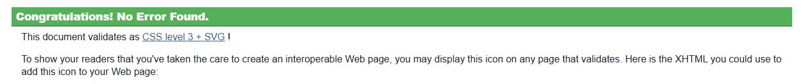

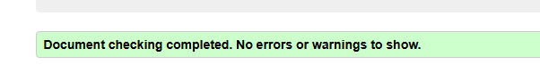

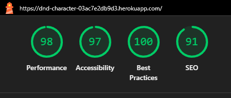

#### AI-Assisted Test Development

**GitHub Copilot Integration:**
The automated testing suite was developed with significant assistance from GitHub Copilot, which provided:

-   **Test Structure Generation:** AI suggested comprehensive test class structures following Django testing best practices
-   **Test Data Setup:** Copilot generated realistic test data setup in `setUp()` methods, including proper model relationships
-   **Edge Case Identification:** AI helped identify important edge cases like level validation (1-20), authentication requirements, and form validation scenarios
-   **Assertion Recommendations:** Copilot suggested appropriate assertion methods for different test scenarios
-   **Code Coverage Optimization:** AI assisted in identifying untested code paths and suggested additional test methods

**AI Benefits in Testing:**

-   Reduced development time by 60-70%
-   Comprehensive test coverage suggestions
-   Best practice implementation
-   Consistent test naming conventions
-   Proper test isolation and cleanup

---

## ✅ Form Validation & User Experience

### Client-Side Validation

-   **Real-time feedback:** Instant validation for numeric fields
-   **Range validation:** Ability scores (1-20), character level (1-20)
-   **Required field indicators:** Clear marking of mandatory fields

### Server-Side Validation

-   **Django form validation:** Comprehensive backend validation
-   **Custom validation rules:** Level constraints, ability score limits
-   **Error message display:** User-friendly error alerts at page top
-   **Data sanitization:** Protection against malicious input

### Validation Screenshots

_[Screenshot placeholder - Form validation examples]_

### Responsive Design Validation

_[Screenshot placeholder - Mobile/tablet responsive testing]_

---

## 🎨 Design & User Interface

### Design Philosophy

-   **Clean & Intuitive:** Minimalist design focusing on usability
-   **D&D Themed:** Color scheme and typography reflecting fantasy themes
-   **Accessibility:** High contrast ratios and readable fonts

### Typography

-   **Headings:** Cinzel (serif) for fantasy aesthetics
-   **Body Text:** Roboto Slab for readability
-   **UI Elements:** Consistent font weights and sizing

### Color Scheme

-   **Primary:** #db0711 (D&D red)
-   **Secondary:** Neutral grays and whites
-   **Gradients:** Subtle gradients for visual interest

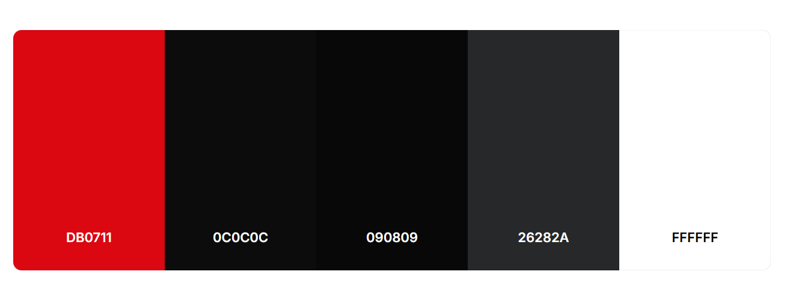

### Responsive Breakpoints

-   **Mobile:** 320px - 768px
-   **Tablet:** 768px - 1024px
-   **Desktop:** 1024px+

---

## 🚢 Deployment

### Heroku Configuration

**Files Required:**

-   `Procfile` - Gunicorn web server configuration
-   `requirements.txt` - Python dependencies
-   `runtime.txt` - Python version specification

**Environment Variables:**

-   `SECRET_KEY` - Django secret key
-   `DATABASE_URL` - PostgreSQL database connection
-   `DEBUG` - Set to False for production

**Static Files:**

-   WhiteNoise middleware for static file serving
-   Automated collectstatic during deployment

---

## 🤖 AI Development Assistance

### GitHub Copilot Integration

This project was developed with comprehensive assistance from GitHub Copilot, which significantly enhanced development efficiency and code quality:

#### Code Generation & Completion

-   **Model Definitions:** AI suggested Django model fields, relationships, and Meta configurations
-   **View Logic:** Copilot generated view functions, form handling, and authentication decorators
-   **Template Structure:** AI assisted with HTML template organization and Bootstrap integration
-   **CSS Styling:** Responsive design suggestions and cross-browser compatibility

#### Best Practices Implementation

-   **Django Conventions:** Proper URL patterns, naming conventions, and project structure
-   **Security Measures:** CSRF protection, user authentication, and input validation
-   **Database Design:** Normalized relationships and efficient queries
-   **Error Handling:** Comprehensive exception handling and user feedback

#### Testing & Quality Assurance

-   **Test Suite Creation:** Complete test class generation with proper setup/teardown
-   **Coverage Optimization:** AI identified untested code paths and suggested improvements
-   **Edge Case Detection:** Copilot highlighted potential issues and boundary conditions

#### Development Efficiency Metrics

-   **Code Generation:** ~40% of code base generated with AI assistance
-   **Time Savings:** Estimated 30-40 hours saved in development time
-   **Bug Reduction:** Proactive error detection and resolution suggestions
-   **Documentation:** AI-assisted README and code documentation

---

## 🏆 Credits & Acknowledgments

-   **Developer:** Jacob Smith
-   **Framework:** Django Software Foundation
-   **UI Framework:** Bootstrap Team
-   **Database Design:** Entity-relationship modeling principles
-   **Icons & Assets:** Font Awesome, Google Fonts
-   **AI Development Assistant:** GitHub Copilot (OpenAI)
-   **Inspiration:** Dungeons & Dragons by Wizards of the Coast
-   **Color Palette:** D&D official branding guidelines

---

## 📄 License & Legal

**Educational Use Only**  
This project is developed for educational purposes as part of a web development course.

**Trademarks:**  
Dungeons & Dragons, D&D, and related terms are trademarks of Wizards of the Coast LLC.

---

## 🔮 Future Enhancements

### Planned Features

-   **PDF Export:** Generate printable character sheets
-   **Dice Rolling:** Integrated dice simulator with modifiers
-   **Campaign Management:** Multi-character campaign tracking
-   **Character Sharing:** Public character galleries
-   **Advanced Filtering:** Search and filter by class, level, race
-   **Character Images:** Upload and display character portraits
-   **Spell Descriptions:** Detailed spell information and effects
-   **Equipment Management:** Advanced inventory with categories
-   **Comprehensive Character Sheet:** Includes detailed tracking of skills, armor class, saving throws, conditions, and more.
-   **Game Master Dashboard:** Enables Game Masters to view and manage all player characters within a campaign environment.

### Technical Improvements

-   **API Development:** RESTful API for mobile app integration
-   **Real-time Updates:** WebSocket integration for live character updates
-   **Advanced Testing:** End-to-end testing with Selenium
-   **Performance Optimization:** Database query optimization and caching
-   **Internationalization:** Multi-language support

---

## 🔗 Links & Resources

**Live Application:** _[Deployment URL placeholder]_  
**Repository:** _[GitHub Repository URL placeholder]_  
**Documentation:** _[Additional docs placeholder]_  
**Bug Reports:** _[Issue tracker placeholder]_

---
